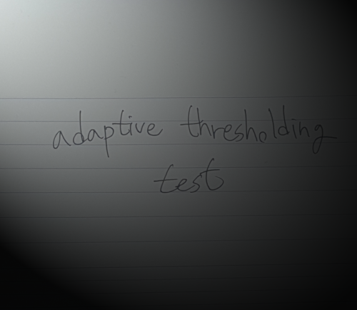
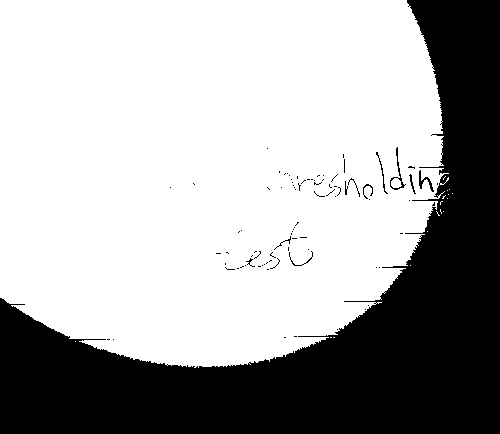
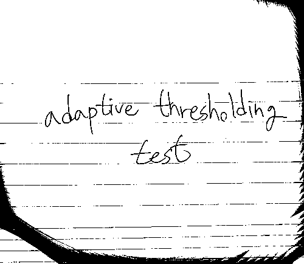

# adaptive thresholding

참조: http://citeseerx.ist.psu.edu/viewdoc/download?doi=10.1.1.420.7883&rep=rep1&type=pdf

| original | normal thresholding | adaptive thresholding |
| - | - | - |
|  |  |  |

## 돌리는 법

```sh
rustc --version # rustc 1.23.0 (766bd11c8 2018-01-01)
cargo --version # cargo 0.24.0 (45043115c 2017-12-05)
cargo run
```
